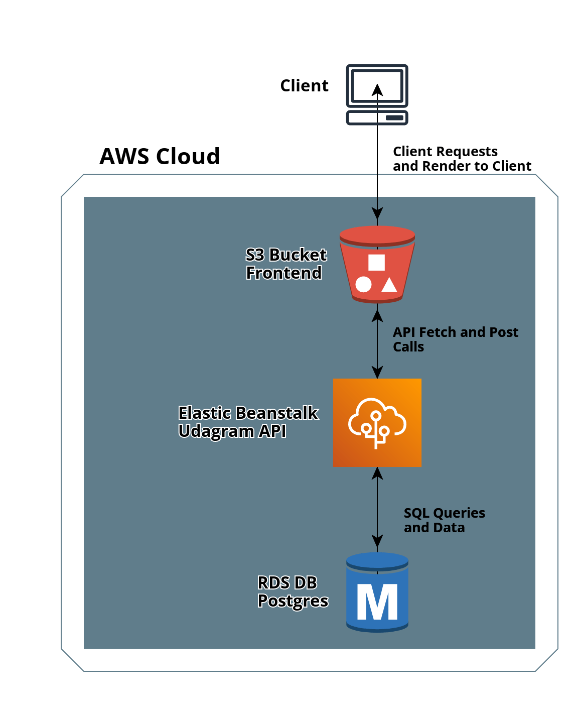

## Udagram Infrastructure Description

### AWS
#### RDS Postgres
AWS RDS Postgres database instance is used for storing and retrieving data.

#### Elastic Beanstalk
The application API server is deployed on AWS Elastic Beanstalk service.

#### S3 Bucket
The frontend application is bundled and uploaded to an AWS S3 bucket that is made publicly readable and served to customers.

#### CircleCI 
CircleCI is the pipeline platform used for Continuous Integration and Deployment

